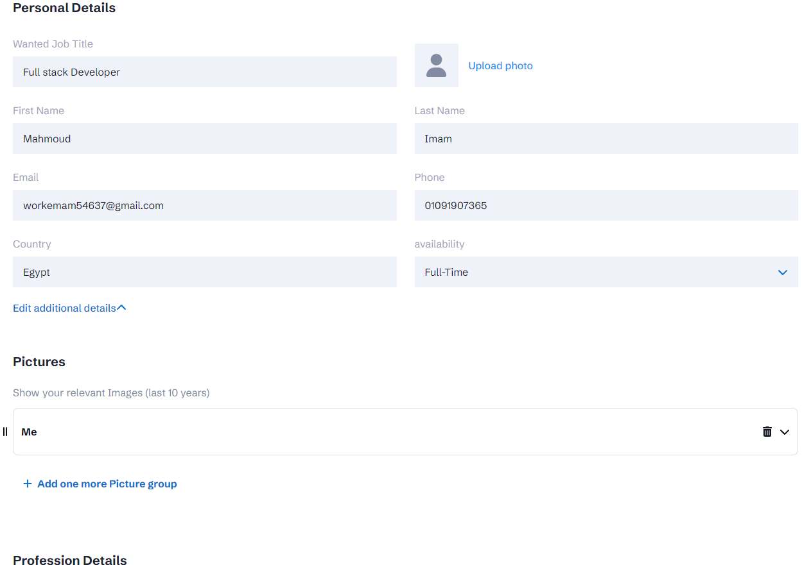

# CV API Generator

Resume-API Builder is a web application developed using Next.js, Express.js, MongoDB, and Tailwind CSS. It aims to simplify the process of generating APIs for resumes, providing users with a convenient and efficient solution. By leveraging Next.js for server-side rendering and combining it with Express.js and MongoDB for backend functionality, the application enables users to create custom APIs for their resumes with ease.


## Live Demo
You can access the live demo [here](https://cv-builder-tobe.onrender.com/).

## Description

Resume-API Builder is designed to streamline the process of generating APIs for resumes. Users can input their resume details and personal information into the application, which then utilizes this data to create a custom API endpoint. This API can be accessed by users or third-party applications, making it easy to fetch and utilize the resume information programmatically.

## Features

- Resume Data Input: The application provides an intuitive interface where users can enter their resume details, such as personal information, work experience, education, skills, and more. This data serves as the foundation for generating the resume API.

- API Generation: Resume-API Builder processes the user's resume information and generates a custom API endpoint. This endpoint can be used to retrieve the resume data programmatically, enabling seamless integration with other applications or platforms.

- Server-Side Rendering: Next.js is used for server-side rendering, ensuring fast loading times and optimal performance. This allows users to efficiently input their resume details and receive the generated API endpoint.

- Backend Functionality: The application utilizes Express.js as the backend framework, facilitating API generation and handling user requests. Express.js provides a robust and flexible server environment for efficient data processing.

- Data Storage with MongoDB: Resume-API Builder integrates with MongoDB to store and manage resume data securely. MongoDB's document-based structure allows for easy storage and retrieval of resume information, ensuring data integrity and scalability.

- Styling with Tailwind CSS: The application's user interface is designed using Tailwind CSS, a utility-first CSS framework. Tailwind CSS provides a customizable and responsive styling solution, enhancing the user experience.

## Getting Started

To run the project locally, follow these steps:

1. Clone the repository:

   ```shell
   git clone https://github.com/Emam546/cv-builder
   ```
2. Install the dependencies:

   ```shell
   npm install
   ```

3. Start the development server:

    ```shell
   npm dev
   ```
****